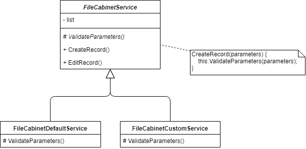
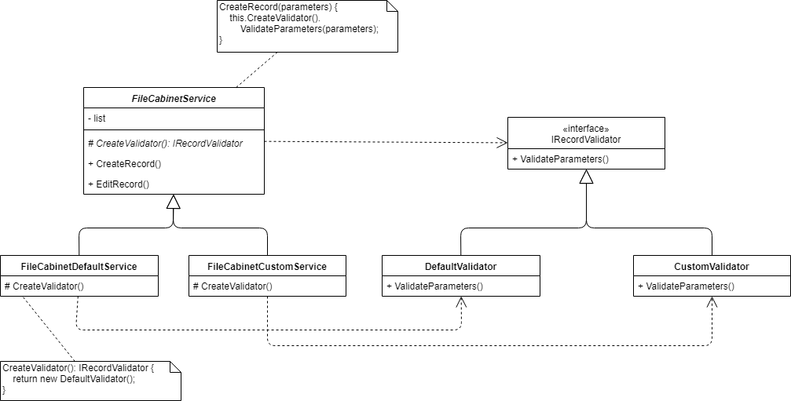
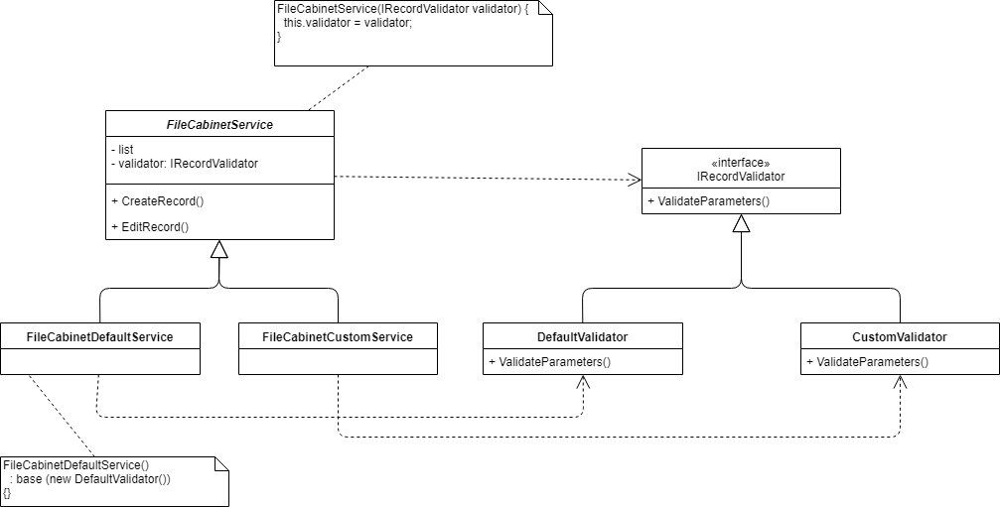

# File Cabinet

## Шаг 5 - Рефакторинг

Цель: улучшение структуры кодовой базы и качества кода.

Все изменения (commits) должны храниться в ветке _step5-refactoring_, а после окончания работы должны быть слиты в ветку _master_ с помощью *squash* merge (все комментарии ветки должны быть слиты вместе).

### Материалы

Проработайте дополнительные материалы, чтобы получить недостающие знания и умения.

* [Соглашения о написании кода на C#](https://docs.microsoft.com/ru-ru/dotnet/csharp/programming-guide/inside-a-program/coding-conventions)
* [Do good code: 8 правил хорошего кода](https://habr.com/ru/company/geekbrains/blog/270001/)
* [Writing High Quality Code in C#](https://www.slideshare.net/nakov/writing-high-quality-code-in-c)
* [C# Coding Guidelines](https://csharpcodingguidelines.com/), [Рекомендации по написанию кода на C# от Aviva Solutions](https://habr.com/ru/post/272053/)
* [Качество кода: именование переменных, чистый код, code review - Основы программирования](https://www.youtube.com/watch?v=3lBZP27pxfA)
* [DI vs. DIP vs. IoC](http://sergeyteplyakov.blogspot.com/2014/11/di-vs-dip-vs-ioc.html)


### Выполнение

#### Качество кода

Просмотрите код проекта, найдите в нем слабые места, используя _Writing High Quality Code in C#_ в качестве справочника.

Обратите внимание на:

* Именование локальных переменных и параметров, полей, классов, методов.
* Структуру и размер методов, проверку входных параметров.
* Наличие "магических чисел", использование строковых литералов.
* Форматирование и единый стиль кода.

Задайте себе эти вопросы:

* Легко ли читать и понимать мой код? Легко ли его поймет другой человек?
* Легко ли поддается мой код расширению? Легко ли добавить в приложение новую функциональность?
* Обрабатывает ли мой код все ошибки и нестандартные ситуации? Всегда ли он ведет себя корректно и ожидаемо при любых входных данных?
* Уверен ли я, что мой код написан и структурирован в едином стиле? Выдают ли анализаторы кода предупреждения и ошибки при компиляции?

Исправьте все найденные слабые места.

Commit "Fix code style, code smells and other code issues".


#### Документация

Включите (Warning) предупреждение для правила [SA1600](https://github.com/DotNetAnalyzers/StyleCopAnalyzers/blob/master/documentation/SA1600.md) и отключите (None) правило [SA1610](https://github.com/DotNetAnalyzers/StyleCopAnalyzers/blob/master/documentation/SA1610.md) в файле _code-analysis.ruleset_. Соберите проект. Добавьте документацию для классов, методов и параметров, чтобы исправить все предупреждения анализатора.

Commit "Enable SA1600 StyleCop rule. Add code documentation."


#### Рефакторинг параметров

Методы _FileCabinetService.CreateRecord_ и _FileCabinetService.EditRecord_ принимают много аргументов. Подумайте над недостатками такого подхода. Примените технику [Introduce Parameter Object](https://refactoring.guru/ru/introduce-parameter-object).

Commit "Introduce parameter object for FileCabinetService.CreateRecord and FileCabinetService.EditRecord methods."


#### Поддержка изменений

1. Методы FileCabinetService.CreateRecord и FileCabinetService.EditRecord проверяют входные данные одинаковым образом и используют одинаковые критерии для проверки. Эти критерии могут изменяться, а потребность в изменении правил приведет к изменению кода сервиса. Это является нарушением [OCP](http://sergeyteplyakov.blogspot.com/2014/08/open-closed-principle.html):

_Мейер хочет, чтобы было легко изменять поведение модуля без изменения его исходного кода!_

Модуль в данном случае - это класс _FileCabinetService_. Обеспечить изменение критериев проверки без изменения кода класса _FileCabinetService_ можно с помощью шаблона проектирования - [Template Method](https://refactoring.guru/ru/design-patterns/template-method).



Реализуйте этот шаблон, как показано на [диаграмме классов](https://ru.wikipedia.org/wiki/%D0%94%D0%B8%D0%B0%D0%B3%D1%80%D0%B0%D0%BC%D0%BC%D0%B0_%D0%BA%D0%BB%D0%B0%D1%81%D1%81%D0%BE%D0%B2). В класс _FileCabinetDefaultService_ поместите существующие проверки значений параметров, а в класс _FileCabinetCustomService_ - проверки с новыми критериями (придумать самостоятельно). В классе Program используйте _FileCabinetCustomService_, чтобы приложение начало работать с новыми критериями. 

Commit "Introduce template method for parameter validation in FileCabinetService."

2. Добавьте параметр командной строки приложения с помощью которого можно указать тип правил проверки. Параметр должен уметь работать в двух режимах - полном (--validation-rules <validation-rules>) и сокращенном (-v <validation-rules>). Имя набора правил может быть "default" (используется _FileCabinetDefaultService_) или "custom" (_FileCabinetCustomService_), параметр должен быть регистронезависимым. По-умолчанию должен использоваться набор правил "default".

Пример использования:

```sh
$ FileCabinetApp.exe
File Cabinet Application, developed by Dmitry Georgiev
Using default validation rules.
Enter your command, or enter 'help' to get help.

$ FileCabinetApp.exe --validation-rules=Default
File Cabinet Application, developed by Dmitry Georgiev
Using default validation rules.
Enter your command, or enter 'help' to get help.

$ FileCabinetApp.exe -v DEFAULT
File Cabinet Application, developed by Dmitry Georgiev
Using default validation rules.
Enter your command, or enter 'help' to get help.

$ FileCabinetApp.exe --validation-rules=custom
File Cabinet Application, developed by Dmitry Georgiev
Using custom validation rules.
Enter your command, or enter 'help' to get help.

$ FileCabinetApp.exe -v CuStOm
File Cabinet Application, developed by Dmitry Georgiev
Using custom validation rules.
Enter your command, or enter 'help' to get help.
```

Commit "Add validation-rules command line parameter."


#### Рефакторинг структуры классов

1. Template Method не всегда подходит для [реализации вариативности поведения](https://stackoverflow.com/questions/669271/what-is-the-difference-between-the-template-method-and-the-strategy-patterns) классов - для каждого нового набора критериев нужно создавать новый класс, который будет наследовать _FileCabinetService_.

В контексте данного приложения набор правил является частью приложения, которая с высокой вероятностью может быть изменена. Предположим, что планируется внедрение еще одного набора правил. Значит "набор правил" можно обозначить как ["причину изменения"](http://sergeyteplyakov.blogspot.com/2014/08/single-responsibility-principle.html) ("осью изменений") класса. Эта причина независима от основной рабочей задачи сервиса - обеспечить хранение данных и работу с ними. Работу валидаторов можно вынести в отдельный функциональный блок ([классы-стратегии](https://refactoring.guru/ru/design-patterns/strategy)), а также применить [DIP](http://sergeyteplyakov.blogspot.com/2014/09/the-dependency-inversion-principle.html) - внести новую зависимость на _IRecordValidator_:



Перенесите код проверки из _FileCabinetDefaultService_ в _DefaultValidator_, а код из _FileCabinetCustomService_ - в _CustomValidator_.

Commit "Move validation from template method to validation strategy."

2. В приложении появилось много [связей is-a и has-a](https://www.linkedin.com/pulse/types-relationships-object-oriented-programming-oop-sarah-el-dawody). Заполните колонку Relationship в таблице связей:

| Class 1                    | Class 2            | Relationship |
|----------------------------|--------------------|--------------|
| FileCabinetService         | IRecordValidator   |              |
| FileCabinetDefaultService  | FileCabinetService |              |
| FileCabinetCustomService   | FileCabinetService |              |
| FileCabinetDefaultService  | DefaultValidator   |              |
| FileCabinetCustomService   | CustomValidator    |              |
| DefaultValidator           | IRecordValidator   |              |
| CustomValidator            | IRecordValidator   |              |

3. Структура приложения стала сложной, однако эту сложность можно уменьшить. Структуру приложения можно упросить, сделать код более понятным и читаемым. 

Для начала примените [DI](http://sergeyteplyakov.blogspot.com/2014/11/di-vs-dip-vs-ioc.html) в форме [constructor injection](http://sergeyteplyakov.blogspot.com/2012/12/di-constructor-injection.html):



Commit "Add constructor injection to FileCabinetService."

4. Оставьте только Strategy, зависимость внедряйте при создании объекта сервиса. Удалите ["мертвый код"](https://refactoring.guru/ru/smells/dead-code). Структура классов должна выглядеть как на диаграмме классов:


Commit "Remove Template Method from FileCabinetService."


#### Рефакторинг API класса

1. Некоторые методы сервиса _FileCabinetRecord_ возвращают массив FileCabinetRecord[], таким образом этот тип массива записей является частью публичного API класса:

* Это ограничивает возможности разработчиков сервиса. К примеру, они не смогут в будущем заменить массив записей на List<FileCabinetRecord>.
* При каждом вызове метода создается новый объект массива. При большом количестве записей размер массива может быть достаточно объемным.
* Другие негативные стороны использования массивов в API - см. [Arrays considered somewhat harmful](https://blogs.msdn.microsoft.com/ericlippert/2008/09/22/arrays-considered-somewhat-harmful/).

Замените массив на [ReadOnlyCollection<FileCabinetRecord>](https://docs.microsoft.com/en-us/dotnet/api/system.collections.objectmodel.readonlycollection-1). Подумайте, какое есть преимущество у использования этого типа перед IEnumerable<FileCabinetRecord> в сигнатуре публичного метода класса?

Commit "Replace array on ReadOnlyCollection."

2. Примените [Extract Interface](https://refactoring.guru/ru/extract-interface) к классу сервиса - создайте интерфейс _IFileCabinetService_. Используйте этот интерфейс в классе Program в качестве типа поля сервиса.

Commit "Extract IFileCabinetService."


#### Рефакторинг кода валидации данных

Обработчики команд "create" и "edit" читают данные, которые вводит пользователь, затем проверяют данные на соответствие заданным критериям и вызывают соответствующие методы сервиса.

1. Добавьте в обработчики использование метода _ReadInput_. Первый параметр метода - делегат _converter_, который преобразовывает строку в значение необходимого типа. Второй параметр - делегат _validator_, который проверяет значение на соответствие критериям. Допишите необходимые конвертеры и валидаторы.

```cs
T ReadInput<T>(Func<string, Tuple<bool, string, T>> converter, Func<T, Tuple<bool, string>> validator)
{
    do
    {
        T value;

        var input = Console.ReadLine();
        var conversionResult = converter(input);

        if (!conversionResult.Item1)
        {
            Console.WriteLine($"Conversion failed: {conversionResult.Item2}. Please, correct your input.");
            continue;
        }

        value = conversionResult.Item3;

        var validationResult = validator(value);
        if (!validationResult.Item1)
        {
            Console.WriteLine($"Validation failed: {validationResult.Item2}. Please, correct your input.");
            continue;
        }

        return value;
    }
    while (true);
}
```

Пример использования метода _ReadInput_:

```cs
Console.Write("First name: ");
var firstName = ReadInput(stringConverter, firstNameValidator);

Console.Write("Last name: ");
var lastName = ReadInput(stringConverter, lastNameValidator);

Console.Write("Date of birth: ");
var dob = ReadInput(dateConverter, dateOfBirthValidator);
```

Измените функциональность валидации входных данных таким образом, чтобы применение правил валидации зависело от параметра validation-rules.
