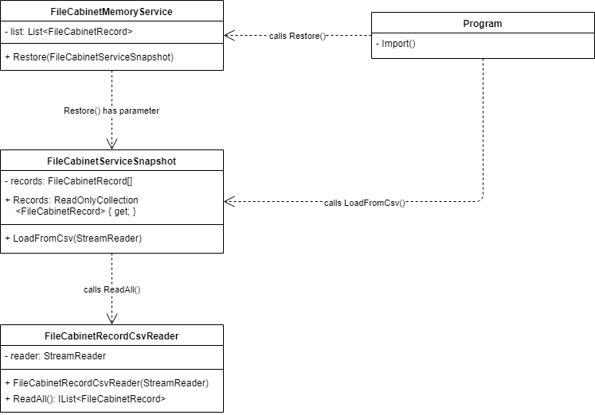
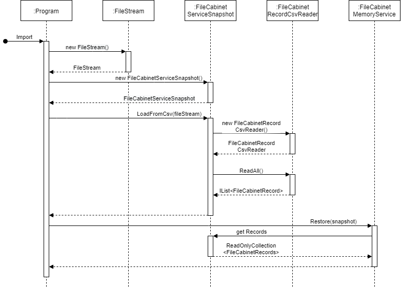

# File Cabinet

## Шаг 9 - Импорт из CSV и XML

Цель: реализовать импорт данных из файлов формата CSV и XML.

Изменения каждого шага (нумерованного абзаца) должны находиться в отдельном коммите, который должен иметь понятное и ясное описание.


### Материалы

* [Introducing XML Serialization](https://docs.microsoft.com/en-us/dotnet/standard/serialization/introducing-xml-serialization)
* [How to: Serialize an Object](https://docs.microsoft.com/en-us/dotnet/standard/serialization/how-to-serialize-an-object)
* [How to: Qualify XML Element and XML Attribute Names](https://docs.microsoft.com/en-us/dotnet/standard/serialization/how-to-qualify-xml-element-and-xml-attribute-names)
* [Examples of XML Serialization](https://docs.microsoft.com/en-us/dotnet/standard/serialization/examples-of-xml-serialization)
* [XmlSerializer](https://docs.microsoft.com/en-us/dotnet/api/system.xml.serialization.xmlserializer)


### Задание

#### Генератор данных

1. Создайте новое консольное приложение в корневом каталоге - _FileCabinetGenerator_ и добавьте его в _FileCabinet.sln_.

2. Добавьте поддержку следующих параметров коммандной строки:

| Full Parameter Name | Short Parameter Name | Description                    |
|---------------------|----------------------|--------------------------------|
| output-type         | t                    | Output format type (csv, xml). |
| output              | o                    | Output file name.              |
| records-amount      | a                    | Amount of generated records.   |
| start-id            | i                    | ID value to start.             |

Пример использования:

```sh
$ FileCabinetGenerator.exe --output-type=csv --output=d:\data\records.csv --records-amount=10000 --start-id=30
10000 records were written to records.csv.

$ FileCabinetGenerator.exe -t xml -o c:\users\myuser\records.xml -a 5000 -i 45
5000 records were written to c:\users\myuser\records.xml
```

3. Реализуйте генератор данных для полей _FileCabinetRecord_. Данные должны выбираться случайным образом, значения должны соответствовать набору правил "default". Генерация поля идентификатора начинается со значения, которое задано параметром start-id. Последующие значения вычисляются как инкремент предыдущего значения.

4. Реализуйте экспорт данных в файл формата CSV.

5. Реализуйте экспорт данных в файл формата XML. Для создания XML-документа используйте _XmlSerializer_ и атрибуты (_XmlRoot_, _XmlElement_, _XmlAttribute_).


#### Импорт CSV

1. Реализуйте в приложении _FileCabinetApp_ новую команду "import csv" с параметром, который задает путь к импортируемому файлу. Импортируемые записи должны добавляться к существующим записям. В случае, если импортируемая запись уже существует в хранилище (у них совпадают идентификаторы), существующая запись перезаписывается данными из импортируемой записи.

Пример использования:

```sh
> import csv d:\data\records.csv
10000 records were imported from d:\data\records.csv.

> import csv d:\data\records2.csv
Import error: file d:\data\records.csv is not exist.
```

2. Реализуйте импорт данных для _FileCabinetMemoryService_.

Диаграмма классов решения:



Диаграмма последовательности решения:



Если при импорте возникает нарушение правил данных, то приложение должно отобразить в консоль идентификатор ошибочной записи, текст ошибки и перейти к следующей записи. Таким образом, записи, которые нарушают установленные при запуске приложения правила, должны быть пропущены.

3. Реализуйте импорт данных для _FileCabinetFilesystemService_.


#### Импорт XML

1. Реализуйте новую команду "import xml" по аналогии с командой "import csv". Используйте десериализацию с помощью _XmlSerializer_ и атрибутов. 

Пример использования:

```sh
> import xml c:\users\myuser\records.xml
5000 records were imported from c:\users\myuser\records.xml.
```

2. Реализуйте импорт данных для _FileCabinetMemoryService_ и _FileCabinetFilesystemService_.