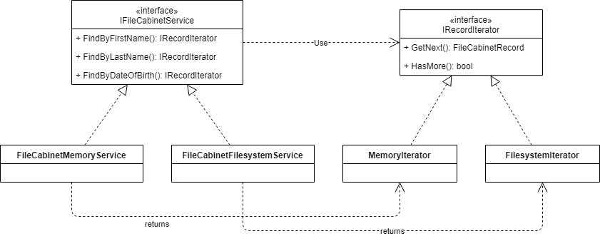

# File Cabinet

## Шаг 12 - Поиск записей в файле

Цель: улучшить возможности поиска.

### Задания

#### Поиск в файле

Записи в файле данных располагаются последовательно и поиск записи по значению поля осуществляется последовательным перебором. Т.о. сложность поиска составляет в худшем случае O(n).

Добавьте в класс _FileCabinetFilesystemService_ индексы по полям, где ключем будет искомое поле, а значением - список смещений записей от начала файла. Выберите подходящую структуру данных для хранения индекса, используя [таблицу сложности операций для Dictionary, SortedDictionary, SortedList](https://stackoverflow.com/questions/1427147/sortedlist-sorteddictionary-and-dictionary), если известны предполагаемые условия работы сервиса: частое добавление большого количества элементов, требуется минимальное время отклика; редкие удаления; частый поиск, время отклика не важно.

#### Рефакторинг

Методы сервиса _Find..._ возвращают подготовленную коллекцию элементов, таким образом вычисление всех элементов коллекции должно происходить заранее. Такой подход не всегда оправдан. Например, когда элементов последовательности очень много массив всех элементов может занять много оперативной памяти или вообще не поместиться в ней. Или, когда вычисление всех элементов может отнять много времени. Примените шаблон [Iterator](https://refactoring.guru/ru/design-patterns/iterator).

Для _FileCabinetMemoryService_ оставьте прежнее поведение - итератор должен возвращать элемент из заранее созданного массива. Для _FileCabinetFilesystemService_ итератор должен читать текущую запись из файла при каждом вызове методы _GetNext_.
